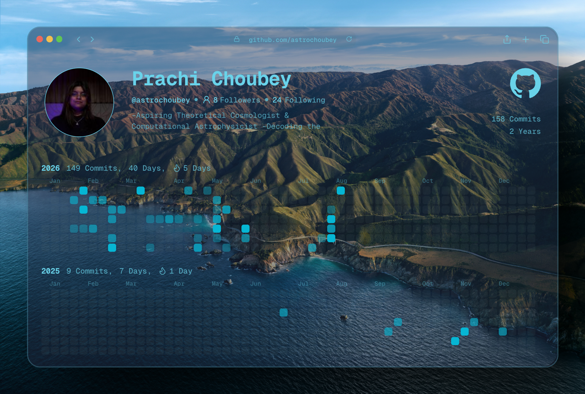

<div align="center">

# Hi there! I'm Choubey!

### _Aspiring Theoretical Physicist • Cosmologist • Astrophysicist_


---


[](portfolio-link)
[](https://www.linkedin.com/in/prachi-choubeyyy/)
[](https://scholar.google.com/citations?hl=en&authuser=1&user=pdxQ6LcAAAAJ)
[](https://orcid.org/0009-0008-0481-3021)
[](mailto:prachichoubey.thenexusphysics@gmail.com)

</div>

---

# 🌌 About Me

```yaml
Prachi Choubey

University: Newton School of Technology, Rishihood University

Degree: BTech (CS) and BSc (Physics)

Major: CS and Physics

Research Interest:
  - Inflationary Cosmology
  - Dark Matter and Dark Energy Physics
  - Early Universe Physics
  - Quantum Field Theory
  - General Relativity
  - Computational Astrophysics
  - High Energy Phyiscs
  - Astroparticle Physics

Languages:
  - Python
  - TypeScript

Currently Learning:
  - Differential Geometry
  - Quantum Field Theory
  - General Relativity
  - Bayesian Inference
  -

Current Goal: Reproduce landmark cosmology papers and contribute
  to open-source scientific software.
```

---

# 🔭 Current Research

- 📖 Reading: **_Observational Evidence from Supernovae for an Accelerating Universe and a Cosmological Constant_**
- 🧠 Studying: **_Cosmic Inflation and Cosmological Constants_**
- 🚀 Building: **_Ignis Rocket Flight Simulator_**
- ✍️ Writing: **_Research Notes_**

---

# 🧪 Featured Research Projects

| Project       | Description   | Status    |
| ------------- | ------------- | --------- |
| IGNIS         | Rocket Flight | P1        |
|               | Simulator     | Completed |
|               |               |           |
| Paper         |               | In        |
| Reproductions | Inflation     | Progress  |

---

# 📚 Current Reading List

- ☐ Observational Evidence from Supernovae for an Accelerating Universe and a Cosmological Constant
- ☐ Strong Progenitor Age-bias in Supernova Cosmology. II. Alignment with DESI BAO and Signs of a Non-Accelerating Universe
- ☐ Pantheon+ supernovae corrected for progenitor age indicate the universe is decelerating
- ☐ Still Accelerating: Type Ia supernova cosmology is robust to host galaxy age evolution
- ☐ East of Eden
- ☐ Pet Semetary

---

# 🛠 Tech Stack

## Programming

<p>


</p>

---

## Scientific Computing

<p>


</p>

---

## Physics & Astronomy

- EinsteinPy
- Astropy
- CAMB
- CLASS
- healpy
- Lightkurve
- emcee
- Cobaya

---

# 📈 GitHub Statistics


# 📊 Contribution Graph

<p align="center">



</p>

---

# 🏆 Achievements

- 🏅 IIT Mandi SkyQues 3rd Winner
- 🏅 SIH Finalists r2 2025
- 🏅 VP of Society For Aerospace And Space Technology

---

# 📖 Publications

Coming Soon...

---

# 📷 Gallery

```
images/

banner.gif

workspace.png

simulation.png

figure1.png

paper.png
```

---

# 🎯 2026 Goals

- [ ] Reproduce first research paper
- [ ] Publish research notes
- [ ] Learn General Relativity
- [ ] Learn Quantum Field Theory
- [ ] Build cosmology simulation package
- [ ] Contribute to open-source scientific software
- [ ] Read 50 research papers

---

# 🌠 Quote

> _"I will take responsibility for what I have done. If I must fall, I will rise each time a better man." -Brandon Sanderson_

---

<div align="center">

### Thanks for visiting!


</div>
